<div id="top"></div>


<!-- PROJECT LOGO -->
<br />
<div align="center">
  <a href="https://github.com/sharab786/dfe5-supermaket-repo">
    
  </a>

<h3 align="center">Smashing Supermarket</h3>

  <p align="center">
	This is a Supermarket application providing a REST API to a product table in a database. This ia Spring Boot Java API project which supports all the CRUD operations for the products in the store. It will enable the user to delete, update, get and create new products for the store. 
    <br />
    <br />
    <a href="https://shahid12.atlassian.net/jira/software/projects/SUP/boards/2">View Jira Board</a>
    ·
    <a href="/documentation/Entity.pdf">View ERD</a>
    ·
    <a href="/documentation/Risk.pdf">Risk Register</a>
  </p>
</div>


<!-- TABLE OF CONTENTS -->
<details>
  <summary>Table of Contents</summary>
  <ol>
    <li>
      <a href="#why-are-we-doing-this">Why are we doing this?</a>
      <ul>
        <li><a href="#spring-boot-dependencies">Spring Boot Dependencies</a></li>
      </ul>
    </li>
    <li><a href="#how-i-expected-the-challenge-to-go">How I expected the challenge to go</a></li>
    <li><a href="#spring-profiles">Spring Profiles</a></li>
    <li>
      <a href="#rest-api">Rest API</a>
      <ul>
        <li><a href="#create-api">Create API</a></li>
        <li><a href="#get_all-api">Get All API</a></li>
	<li><a href="#update-api">Update API</a></li>
	<li><a href="#delete-api">Delete API</a></li>
	<li><a href="#get-api-greater-than-price">Get API greater than price</a></li>
	<li><a href="#get-api-category-and-active-for-sale">Get API category and active for sale</a></li>
      </ul>
    </li>
    <li><a href="#test_coverage_report">Test Coverage</a></li>
    <li><a href="#how-did-it-go">How did it go?</a></li>
    <li><a href="#future-revisions-of-the-project">Future revisions of the project</a></li>
    <li><a href="##acknowledgments">Acknowledgments</a></li>
  </ol>
</details>


<!-- Why are we doing this -->
## Why are we doing this?

This is a project which is part of my assesment for the QA bootcamp in Software development for Java. I am required to create a Spring Boot API with the application back-end developed in Java. The H2 database is utilised for checking the persistence of the data but this should also have the option to work with MySQL. I am using Postman as a means of making the API calls,a series of API calls, used for CRUD functionality. (Create, Read, Update, Delete).

<p align="right">(<a href="#top">back to top</a>)</p>


<!-- Spring Boot Dependencies -->
### Spring Boot Dependencies

* Spring Data JPA
* Spring Web
* H2 Database
* MySQL Driver
* Validation 

<p align="right">(<a href="#top">back to top</a>)</p>

<!-- How I expected the challenge to go -->
## How I expected the challenge to go

I believe this would go well since i have learnt these skills during the bootcamp. There are some challenges on the project management side where i will have to remain focused. Inparticular making sure my branching strategy in GIT/GIT HUB is fit for purpose and to ensure i perform the correct actions. Other areas of attention will be around the documentation and to make sure that i have covered all aspects. This is is to be done in the space of 5 days so therefore need to make sure that i am fully  focused on delivery and will use the Jira board actively to make sure i remain on track. 

<p align="right">(<a href="#top">back to top</a>)</p>


<!-- Spring Profiles -->
## Spring Profiles
Since the requirement was to be able to connect to either H2 database or MySQL database depending on the requirement. To be able to configue different databases at runtime I have created two additional application property files. In the application.properties that comes with Spring Boot by default i have set spring.profiles.active to the active profile to be used.

<!-- Test Profile -->
> **Test Profile**

The test profile will use the H2 database.

```Java	
spring.profiles.active=test
```
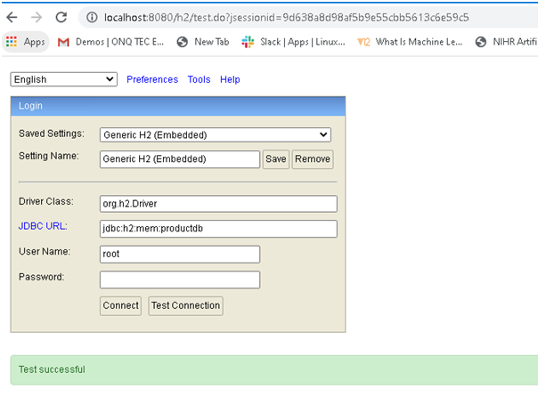
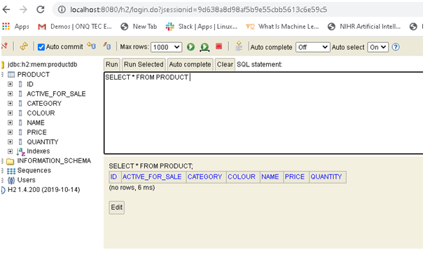


<!-- Prod Profile -->
> **Prod  Profile**
	
```Java	
spring.profiles.active=prod
```

The prod profile will use the MySQL database.


<p align="right">(<a href="#top">back to top</a>)</p>

# REST API

The REST API to the supermaket app is described below.

<!-- Create API-->
## Create API

### Create a new Product

#### Request

`POST /product/create`

This particular test was done with both H2 and MySQL databases to show it works for both. All future tests will only be done with the H2 database.


The H2 database before firing the request.

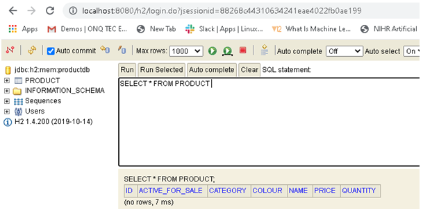

The MySQL database before firing the request.


	
#### Response

**Status code :** _201 Created_

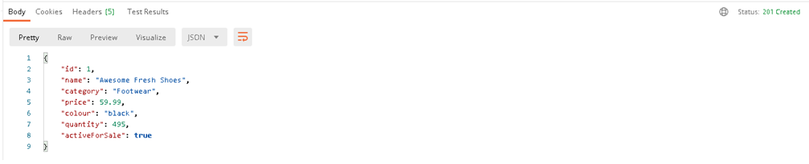

The H2 database after firing the request.


The MySQL database after firing the request.


#### Integration test 

This test created a product and then checked to see if product was created and check the response status _is created_.


<p align="right">(<a href="#top">back to top</a>)</p>


<!-- Get All API -->
## Get All API

### Get list of all Products

#### Request

`Get /product`

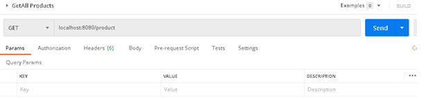

The screenshot below shows the database prior to firing the Get API.


	
#### Response

**Status code :** _200 OK_

The response as shown below is to get a list of all the products in the products table.


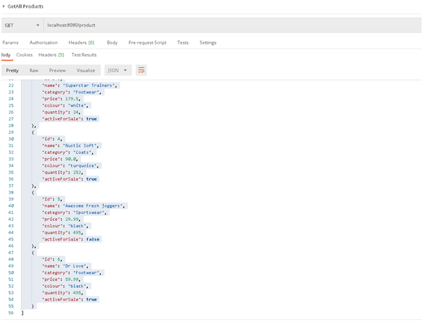

#### Integration test 

This test checked to see if all products were displayed ( against some test data ) and check the response status _isOk_.


<p align="right">(<a href="#top">back to top</a>)</p>


<!-- Update API -->
## Update API

### Change a product by id

#### Request

`PUT /product/{id}`

Request to update product with id of 4. The reqest is to update the price and the colour of the product.

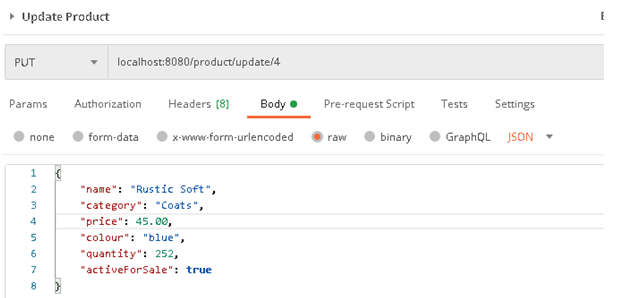

Below, shows database view prior to firing the Update API.


	
	
#### Response

**Status code :** _202 Accepted_

The product has been updated with the new price and new colour.


The screenbelow shows the database after API fired.

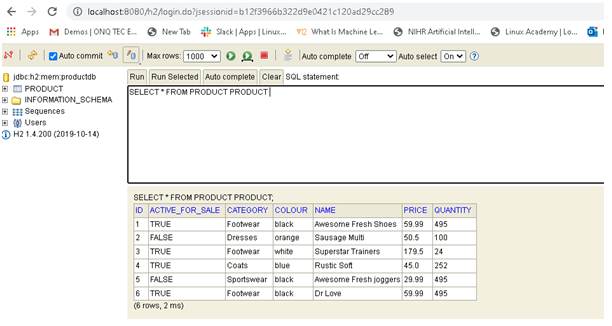

#### Integration test 

This test checked to see if product was updated correctly and check the response status _isAccepted_.


<p align="right">(<a href="#top">back to top</a>)</p>


<!-- Delete API -->
## Delete API

### Delete product by id

#### Request

`DELETE /product/{id}`

This API will be used to delete a product of id 2.


Database prior to firing Delete API.

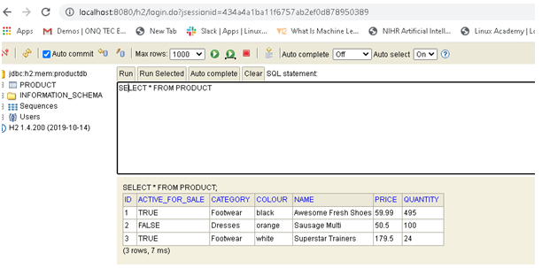

	
#### Response

**Status code :** _200 Ok_

Product of id 2 has been deleted.


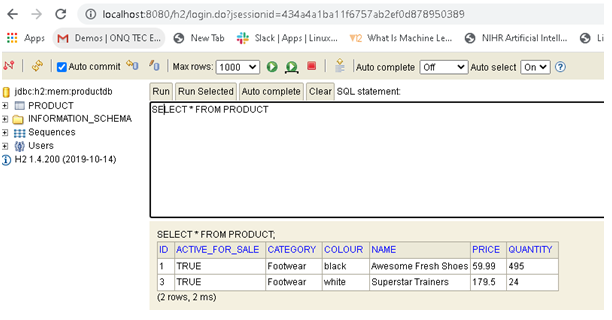

#### Integration test 

This test deleted a product and check the response status _is oK_.

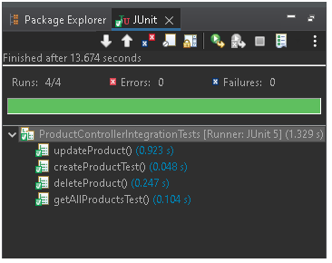

<p align="right">(<a href="#top">back to top</a>)</p>

<!-- Get API greater than price -->
## Get API greater than price

### Get Products greater than price API

#### Request

This API will get all products with price over 440.50.

`GET /product/{price}`

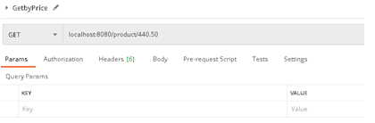

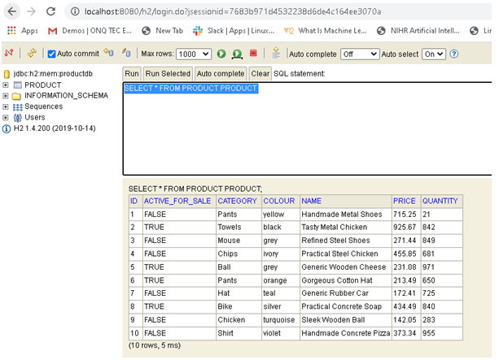

	
#### Response

**Status code :** _200 Ok_


#### Integration test 

This test gets a list of products in the test data which had price over a certain amount and check the response status _is oK_.

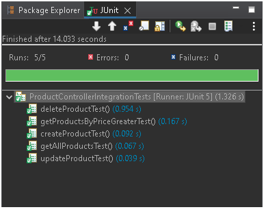

<p align="right">(<a href="#top">back to top</a>)</p>

<!-- Get API category and active for sale -->
## Get API category and active for sale

### Get Products of specific category and whether it is active for sale

#### Request

This API will get all products of category footwear and which are active for sale.

`GET /product//find/{category}/{activeForSale}`

Get list of products which are footwear and active for sale.


	
#### Response

**Status code :** _200 Ok_


#### Integration test 

This test gets a list of products in the test data of a certain category and if active for sale and check the response status _is oK_.


<p align="right">(<a href="#top">back to top</a>)</p>

## Test Coverage

So as you can see from above the integration tests were all carried out successfully. In terms of the test coverage, i managed to achieve a 95.0% test coverage of the src/main/java folder.
</br>
Coverage report


<p align="right">(<a href="#top">back to top</a>)</p>

## How did it go?

I think the actual coding and building the product went well. The basic CRUD opertions were ok. My main challenges were around the writing of this readme since it is the first time I have written one. 
There was one request i found challenging which was Sup6 on the <a href="https://shahid12.atlassian.net/jira/software/projects/SUP/boards/2">Jira Board</a>. This was an API to update the quantity of the product by just specifying the quantity field to update. This would be using the patch api and since we are not returning the whole object another approach would be required. This was past the MVP and was a bonus.
	
<p align="right">(<a href="#top">back to top</a>)</p>	

## Possible improvements for future revisions of the project.
There are a number of improvements that can be made for future revisions of the project. Before starting, a new database design with several tables and also a revised products table would be created, to make sure we apply the data normalization rules to see if the tables are structured correctly.

	* Implement customers entity with full set of CRUD operations to manage customers.
	* Implement orders entity showing the orders placed by customers with full set of CRUD operations to manage orders.
	* Implement orderdetails entity showing the poducts whichin each order with full set of CRUD operations to manage order details.
	* You could do the the same with suppliers and shippers with full set of CRUD operations to manage them. 


<p align="right">(<a href="#top">back to top</a>)</p>


## Acknowledgments

I want to thank all my tutors at QA who helped me to learn the subject matter. I also like to thank my colleagues on the course who contributed to my learning.

<p align="right">(<a href="#top">back to top</a>)</p>
